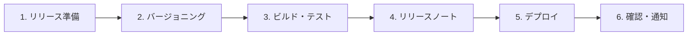

# リリースワークフロー

> プロジェクトのリリースフローを定義します。

## フロー概要



---

## 1. リリース準備

### 手順
1. リリース対象の機能・修正を確認する
2. すべてのPRがマージされていることを確認する
3. リリースブランチを作成する（`release/vX.Y.Z`）

---

## 2. バージョニング

### ルール（Semantic Versioning）
- **MAJOR** (X.0.0): 破壊的変更
- **MINOR** (0.X.0): 新機能追加（後方互換あり）
- **PATCH** (0.0.X): バグ修正

### Gemini CLI の活用
```
前回リリースからの変更を分析し、適切なバージョン番号を提案してください。
Semantic Versioning に従ってください。
```

---

## 3. ビルド・テスト

### 手順
1. すべてのテストを実行する
2. ビルドが成功することを確認する
3. ステージング環境で動作確認する

---

## 4. リリースノート作成

### Gemini CLI の活用
```
前回のリリースからの変更を元にリリースノートを作成してください。
以下のフォーマットに従ってください：

## vX.Y.Z (YYYY-MM-DD)

### ✨ 新機能
### 🐛 バグ修正
### ⚡ パフォーマンス改善
### 📚 ドキュメント
### ⚠️ 破壊的変更
```

---

## 5. デプロイ

### 手順
1. リリースタグを作成する
2. CI/CD パイプラインでデプロイを実行する
3. デプロイ完了を確認する

---

## 6. リリース後の確認・通知

### 手順
1. 本番環境での動作確認
2. モニタリング・アラートの確認
3. チーム・ステークホルダーへの通知
4. リリースブランチの後処理
